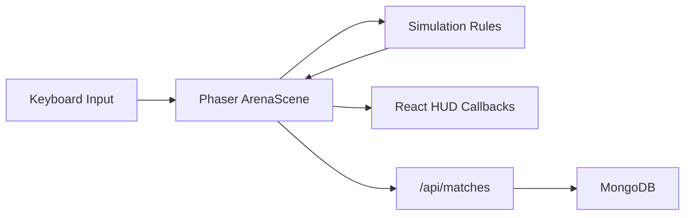

# Architecture

Neon Fuse is a browser-based 2D bomber game.

- Next.js owns app routing, API routes, deployment, and server-only integrations.
- React owns HUD, menus, match setup, result screens, and settings.
- Phaser owns the active game canvas, rendering, animation, input plumbing, camera, and effects.
- Simulation modules own game rules and should be testable without Phaser.
- MongoDB stores durable data such as match history, profiles, maps, and leaderboards.

## Directory Responsibilities

`src/app`

Next.js routes and API endpoints. API routes validate inputs and perform server-side work such as MongoDB writes.

`src/components`

React UI components and DOM overlays.

`src/game/scenes`

Phaser scene orchestration. Scenes adapt simulation state into sprites, tweens, camera movement, and effects. Scenes should stay thin.

`src/game/simulation`

Pure game rules: arena layout, walkability, bombs, blast calculation, bot decisions, damage, powerups, and win conditions.

`src/game/createGame.ts`

The Phaser boot boundary used by the React mount component.

`src/lib`

Server/shared infrastructure such as MongoDB helpers and request schemas.

## Core Boundary Rule

Gameplay rules should not depend on Phaser.

Good:

```ts
calculateBlast(arena, origin, range);
```

Avoid:

```ts
calculateBlast(scene, sprite, camera, tweens);
```

This keeps gameplay rules testable and lets Phaser remain a presentation layer.

## Game Loop Model

The current bot-skirmish loop is:

```text
Round starts
Player and bot spawn
Movement unlocks
Bombs are placed
Blast resolves
Damage and winner are evaluated
Result is posted to /api/matches
Round can reset
```

Future gameplay systems should fit this loop before introducing new scene-level state.

## State Ownership

Simulation state:

- Arena grid cells
- Entity tiles
- Bomb blast rules
- Powerup rules
- Round result rules

Phaser render state:

- Sprites
- Containers
- Tweens
- Textures
- Camera shake
- Particles and temporary effects

React UI state:

- HUD values
- Menus
- Local score display
- Selected game mode

Server state:

- Persisted match results
- Profiles
- Leaderboards
- Generated map or challenge metadata

## Data Flow



## Testing Strategy

Unit tests should cover pure simulation behavior:

- Arena creation
- Walkability
- Blast propagation
- Block destruction
- Bot decision helpers
- Win/loss resolution helpers

## Bot AI

Bot decisions live in pure simulation modules, not Phaser scenes.

- Bot profiles use bounded traits such as aggression, powerup greed, block greed, risk tolerance, and patience.
- The simulation brain returns intents such as wait, move, or plant bomb; Phaser adapts those intents into sprites, tweens, bombs, and HUD updates.
- Future LLM-generated bot personality changes must be structured, validated, and mapped to known profile fields or bounded trait values before they affect gameplay.

Browser or integration tests can come later for:

- Game loads
- Player can move
- Bomb explodes
- Match result is posted

## Security Notes

- MongoDB access is server-only.
- Never expose `MONGODB_URI` to client code.
- API routes must validate request bodies.
- `.env` must not be committed.
- Client-submitted match results are untrusted.
- Competitive multiplayer requires an authoritative server, not client-submitted outcomes.

## AI Boundary

OpenAI API calls must happen server-side only.

LLM output may generate flavor, recommendations, bot profiles, map metadata, post-match coaching, and challenge descriptions. LLM output must not directly mutate live simulation state.

Any LLM response that affects gameplay must use structured JSON, be validated, and map to known game rule IDs or bounded numeric ranges.

Do not call OpenAI APIs from Phaser scenes or React client components.

## Deployment

Vercel hosts the Next.js app and API routes.

Realtime multiplayer should use a separate realtime provider or dedicated game server.

## Merge Checks

Before merging:

```bash
npm run lint
npm run typecheck
npm run test
npm run build
```
